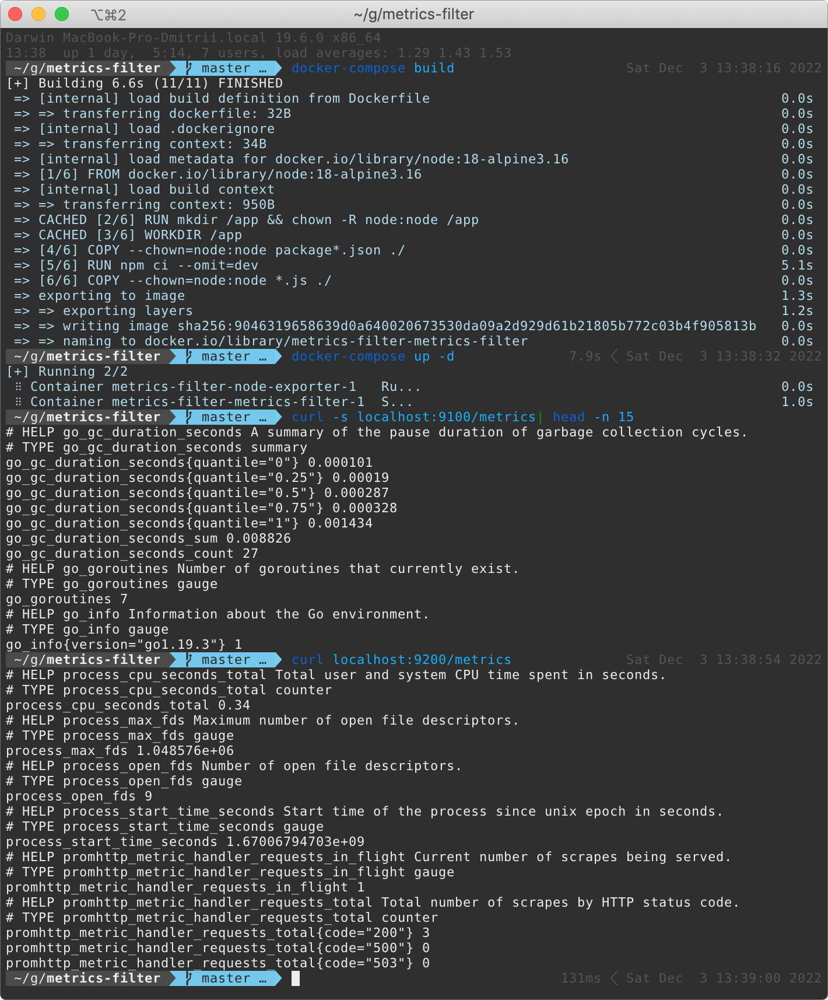

# metrics-filter

### description
Metrics-filter is a service that allows you to request metrics in Prometheus format and filter them according to the allow and block lists.

The service's workflow is:

### quick-start
1. Clone this repository and run `npm run build` or `docker-compose build`.

2. Run node-exporter as metrics source and metrics-filter with [examples rules](docker-compose.yaml), `npm run docker-run` or `docker-compose up -d`.

### Environment Variables

These are the environment variables understood by the container image.
| **Variable**            | **Description**                                                         |
| :---------------------- | :---------------------------------------------------------------------- |
| HOST                    | Address to bind the service, `0.0.0.0` by default                       |
| PORT                    | Port to bind the service, `9200` by default                             |
| REMOTE_METRICS_ENDPOINT | Source of metrics in the format protocol://address:port/metricsendpoint |
| ALLOW_LIST              | List of keywords to keep metrics, can be `, ; \|` separated             |
| BLOCK_LIST              | List of keywords to filter out metrics, can be `, ; \|` separated       |

